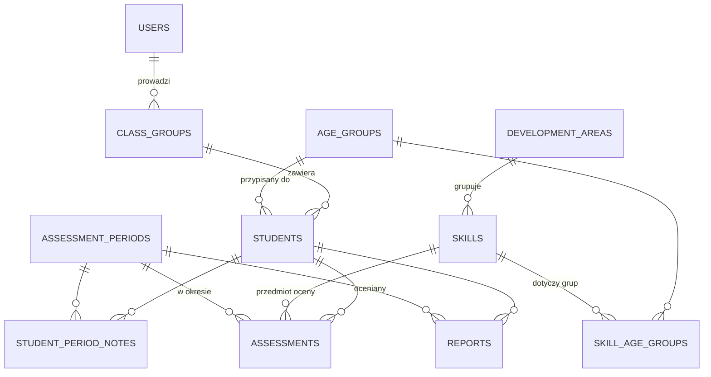

# Ocena Przedszkolaka — projekt techniczny

Aplikacja webowa dla nauczycielki przedszkola do bieżącej oceny postępów dzieci
w klasie oraz generowania semestralnych raportów dla rodziców (z zaleceniami).

## 1. Słownik domeny (nazewnictwo)

Zamiast „cech" proponuję nazwę **umiejętność** (ang. `skill`) — to naturalne
określenie w kontekście diagnozy przedszkolnej („co dziecko potrafi").
Umiejętności grupujemy w **obszary rozwoju** (ang. `development area`),
np. „Motoryka mała", „Mowa i komunikacja", „Samodzielność", „Rozwój społeczny".

| Pojęcie (PL)         | W kodzie (EN)       | Opis |
|----------------------|---------------------|------|
| Nauczyciel           | `User`              | Użytkownik aplikacji (rola `TEACHER` lub `ADMIN`) |
| Klasa / grupa        | `ClassGroup`        | Grupa przedszkolna, np. „Biedronki 2026/2027" |
| Uczeń                | `Student`           | Dziecko w grupie |
| Grupa wiekowa        | `AgeGroup`          | 3-latki, 4-latki, 5-latki, 6-latki — determinuje listę umiejętności |
| Obszar rozwoju       | `DevelopmentArea`   | Kategoria grupująca umiejętności |
| Umiejętność          | `Skill`             | Pojedyncza rzecz do oceny: tytuł, opis, zalecenia dla rodziców |
| Okres oceny          | `AssessmentPeriod`  | Semestr (np. „Semestr I 2026/2027") |
| Ocena                | `Assessment`        | Ocena jednej umiejętności jednego ucznia w jednym okresie (tak / jeszcze nie + notatka) |
| Notatka ogólna       | `StudentPeriodNote` | Swobodny opis ucznia w danym okresie |
| Raport               | `Report`            | Wygenerowany, zamrożony raport semestralny dla rodziców |

Skala oceny: **„Potrafi" / „Jeszcze nie"** (dwustanowa, zgodnie z wymaganiem
tak/nie). Model przewiduje miejsce na rozszerzenie o stan pośredni
(„Częściowo / w trakcie") — enum w bazie, nie boolean.

## 2. Stack technologiczny

| Warstwa    | Technologia | Uwagi |
|------------|-------------|-------|
| Frontend   | React 18 + TypeScript + Vite | React Router, TanStack Query, CSS custom properties (tokeny z makiet) |
| Backend    | Kotlin + Spring Boot 3 | REST API, walidacja, Spring Security |
| Baza       | PostgreSQL 16 | migracje Flyway |
| Uruchomienie | Docker + docker-compose | multi-stage build, frontend serwowany przez nginx |
| CI         | GitHub Actions | build + testy + lint na PR |

> Założenie: stack i praktyki wzorowane na `kma-poker-stats` (React + Kotlin +
> Postgres + Docker). Repo nie było dostępne w tej sesji, więc przyjęto
> typowy, nowoczesny wariant tego stacku — do skorygowania, jeśli tam jest
> np. Ktor zamiast Spring Boota.

### Architektura backendu (warstwowa, pakiety per feature)

```
backend/src/main/kotlin/pl/kma/classevaluation/
├── config/            # Spring Security, CORS, Jackson…
├── auth/              # logowanie, sesje, użytkownicy
├── students/          # uczniowie + grupy
│   ├── api/           # kontrolery + DTO (request/response)
│   ├── domain/        # serwisy, logika, modele domenowe
│   └── persistence/   # repozytoria (Spring Data JDBC)
├── skills/            # obszary rozwoju + umiejętności (konfiguracja)
├── assessments/       # oceny + notatki
└── reports/           # generowanie i snapshoty raportów
```

Zasady:
- kontrolery cienkie, logika w serwisach domenowych; DTO ≠ encje bazodanowe,
- Spring Data JDBC (prostsze od JPA, bez lazy-loading pułapek) + Flyway,
- testy: JUnit 5 + Testcontainers (prawdziwy Postgres w testach integracyjnych).

### Architektura frontendu

```
frontend/src/
├── api/               # klient HTTP (fetch + TanStack Query hooks)
├── components/        # współdzielone komponenty UI
├── features/
│   ├── auth/
│   ├── students/      # lista uczniów, CRUD
│   ├── assessment/    # ekran wypełniania ocen
│   ├── skills/        # konfiguracja umiejętności
│   └── reports/       # podgląd i generowanie raportów
├── layout/            # nawigacja, shell aplikacji
└── types/             # typy współdzielone (generowane z OpenAPI docelowo)
```

## 3. Model danych — encje i powiązania



### Tabele

**users** — nauczycielki / admin
- `id UUID PK`, `email UNIQUE`, `password_hash` (bcrypt/argon2), `display_name`,
  `role` (`TEACHER` | `ADMIN`), `active BOOL`, `created_at`

**class_groups** — grupa przedszkolna w roku szkolnym
- `id UUID PK`, `name`, `school_year` (np. `2026/2027`)

**class_group_teachers** — przypisania nauczycielek do grup (wiele-do-wielu)
- `class_group_id FK→class_groups`, `user_id FK→users`, PK złożony
- szczegóły: [nauczycielki.md](nauczycielki.md)

**age_groups** — słownik grup wiekowych
- `id UUID PK`, `name` („3-latki"…), `min_age_years`, `sort_order`

**students**
- `id UUID PK`, `class_group_id FK`, `first_name`, `last_name`, `birth_date`,
  `age_group_id FK` (podpowiadana z `birth_date` względem roku szkolnego,
  ale edytowalna — nauczycielka może dziecko świadomie przypisać inaczej),
  `active BOOL`, `created_at`
- RODO: przechowujemy **minimum** danych — bez PESEL, adresów itp.

**development_areas** — obszary rozwoju
- `id UUID PK`, `name`, `description`, `sort_order`, `active BOOL`

**skills** — konfigurowalna lista umiejętności
- `id UUID PK`, `area_id FK→development_areas`, `title`, `description`
  (co dokładnie oceniamy / jak sprawdzić),
  `parent_recommendation TEXT` (zalecenie dla rodziców, trafia do raportu,
  gdy dziecko *jeszcze nie* potrafi), `sort_order`, `active BOOL`
- dezaktywacja zamiast usuwania (`active=false`) — historyczne oceny
  pozostają spójne

**skill_age_groups** — M:N umiejętność ↔ grupa wiekowa
- `skill_id FK`, `age_group_id FK`, `PK(skill_id, age_group_id)`
- to z tej relacji wynika, że 3-latek ma inną listę do oceny niż 5-latek;
  ta sama umiejętność może dotyczyć kilku grup wiekowych

**assessment_periods** — semestry
- `id UUID PK`, `school_year`, `name` („Semestr I"), `starts_on`, `ends_on`,
  `status` (`OPEN` | `CLOSED`)

**assessments** — serce aplikacji
- `id UUID PK`, `student_id FK`, `skill_id FK`, `period_id FK`,
  `value` enum: `MASTERED` („potrafi") | `NOT_YET` („jeszcze nie")
  (rozszerzalne o `IN_PROGRESS`), `note TEXT NULL` (freetext do umiejętności),
  `updated_by FK→users`, `updated_at`
- `UNIQUE(student_id, skill_id, period_id)` — upsert przy zapisie
- brak wiersza = „nieocenione"; `value` może być NULL, gdy zapisano samą
  notatkę bez rozstrzygnięcia

**student_period_notes** — notatka ogólna o dziecku w semestrze
- `id UUID PK`, `student_id FK`, `period_id FK`, `content TEXT`,
  `UNIQUE(student_id, period_id)`

**reports** — zamrożony raport dla rodziców
- `id UUID PK`, `student_id FK`, `period_id FK`, `generated_at`,
  `generated_by FK→users`, `content JSONB` — **snapshot** ocen, opisów
  i zaleceń z chwili generowania (późniejsza zmiana konfiguracji umiejętności
  nie zmienia wydanego raportu), `UNIQUE(student_id, period_id)` z możliwością
  ponownego wygenerowania (nadpisanie po potwierdzeniu)

### Kluczowe reguły biznesowe

1. **Lista umiejętności ucznia** = `skills` aktywne ∩ przypisane do
   `age_group` ucznia, pogrupowane po `development_area`.
2. **Postęp wypełnienia** = liczba ocen / liczba umiejętności dla grupy
   wiekowej ucznia (pokazywany na liście uczniów).
3. **Raport** = sekcja „Potrafi" (`MASTERED`), sekcja „Nad czym pracujemy"
   (`NOT_YET` + `parent_recommendation` każdej umiejętności), notatki
   nauczycielki (per umiejętność i ogólna), dane okresu i grupy.
4. Zamknięcie okresu (`CLOSED`) blokuje edycję ocen w tym okresie
   (z możliwością ponownego otwarcia przez admina).

## 4. API (REST, JSON)

```
POST   /api/auth/login                 # sesja HttpOnly cookie
POST   /api/auth/logout
GET    /api/auth/me

GET    /api/class-groups
POST   /api/class-groups
GET    /api/class-groups/{id}/students          # + postęp wypełnienia
POST   /api/class-groups/{id}/students
PATCH  /api/students/{id}
DELETE /api/students/{id}                       # soft-delete (active=false)

GET    /api/development-areas                   # z umiejętnościami (konfiguracja)
POST   /api/development-areas
PATCH  /api/development-areas/{id}
POST   /api/skills
PATCH  /api/skills/{id}                         # w tym przypisanie grup wiekowych
GET    /api/age-groups

GET    /api/periods
POST   /api/periods
PATCH  /api/periods/{id}                        # open/close

GET    /api/students/{id}/assessment?periodId=  # umiejętności wg wieku + istniejące oceny
PUT    /api/students/{id}/assessments/{skillId}?periodId=   # upsert {value, note}
PUT    /api/students/{id}/period-note?periodId=             # upsert notatki ogólnej

POST   /api/students/{id}/reports?periodId=     # generuje snapshot
GET    /api/reports/{id}                        # JSON do podglądu
GET    /api/reports/{id}/print                  # widok HTML print-friendly
GET    /api/class-groups/{id}/reports?periodId= # zbiorczo dla całej grupy
```

Zapis oceny jest **pojedynczym, idempotentnym upsertem** — frontend zapisuje
każdą zmianę od razu (autosave), bez przycisku „Zapisz wszystko". To
najważniejsza decyzja UX/API: wypełnianie ma być szybkie i odporne na
zamknięcie karty.

### Raporty — generowanie

W v1: raport = widok HTML z arkuszem stylów `@media print` → nauczycielka
drukuje / zapisuje do PDF z przeglądarki (zero zależności). W v2 opcjonalnie
PDF po stronie serwera (openhtmltopdf) do wysyłki mailem.

## 5. Bezpieczeństwo i RODO

Dane dzieci = dane wrażliwe organizacyjnie — projekt zakłada:

- **Uwierzytelnianie**: sesja w HttpOnly + Secure + SameSite=Lax cookie,
  hasła bcrypt (Spring DelegatingPasswordEncoder — łatwa migracja na
  Argon2id); brak JWT w localStorage (XSS-odporność).
- **Autoryzacja**: nauczycielka widzi wyłącznie grupy, do których jest
  przypisana (`class_group_teachers`); rola `ADMIN` zarządza kontami,
  grupami, konfiguracją umiejętności i okresami. Kontrola dostępu
  egzekwowana w serwisach (nie tylko w UI).
- **CSRF**: token dla żądań mutujących (Spring Security domyślnie).
- **Minimalizacja danych**: tylko imię, nazwisko, data urodzenia.
- **Rate limiting** na `/api/auth/login` + audyt (`updated_by`, `updated_at`
  na ocenach; log logowań).
- **Transport**: TLS na reverse proxy (Caddy/nginx) w deploymencie.
- **Kopie zapasowe**: `pg_dump` w cronie kontenera pomocniczego; szyfrowanie
  backupów.
- Walidacja wejścia na DTO (Bean Validation), nagłówki bezpieczeństwa
  (CSP, X-Content-Type-Options) ustawiane centralnie.

## 6. Uruchomienie — Docker

```
docker-compose.yml
├── db        # postgres:16-alpine, volume, healthcheck
├── backend   # multi-stage: gradle build → JRE 21 slim
└── frontend  # multi-stage: npm build → nginx (proxy /api → backend)
```

- `docker-compose.dev.yml`: sam Postgres — backend i frontend odpalane
  lokalnie (`./gradlew bootRun`, `npm run dev` z proxy Vite).
- Konfiguracja przez zmienne środowiskowe (12-factor), sekrety poza repo
  (`.env` w `.gitignore`, `.env.example` w repo).

## 7. Plan wdrożenia (iteracje)

1. **MVP**: auth, CRUD uczniów, seed umiejętności (migracja Flyway
   z przykładowym zestawem dla 3–6 latków), ekran oceniania z autosave.
2. Konfiguracja umiejętności w UI + okresy.
3. Raporty (podgląd + druk) + zamykanie semestru.
4. Dopieszczenie: eksport zbiorczy, stan „częściowo", statystyki grupy.
