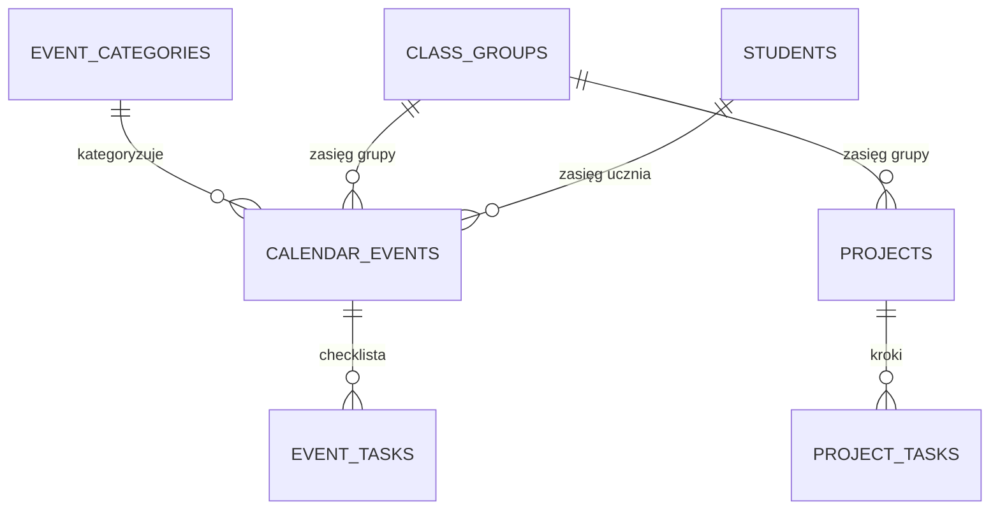

# Kalendarz i projekty — propozycja rozwiązania

Rozszerzenie aplikacji o **kalendarz** (organizer + notatki) przechowujący
wydarzenia o różnych zasięgach (ogólnopolskie, przedszkolne, grupy, ucznia)
oraz o **projekty** z okresem trwania i postępem (wycieczki, konkursy),
naniesione na ten sam kalendarz.

## 1. Słownik domeny

| Pojęcie (PL)        | W kodzie (EN)          | Opis |
|---------------------|------------------------|------|
| Wydarzenie          | `CalendarEvent`        | Wpis w kalendarzu: święto, dzień/tydzień tematyczny, uroczystość, przypomnienie |
| Kategoria wydarzenia| `EventCategory`        | Słownik konfigurowalny: „Święto", „Dzień tematyczny", „Tydzień tematyczny", „Uroczystość"… — z kolorem |
| Zasięg              | `EventScope`           | `NATIONAL` \| `PRESCHOOL` \| `CLASS_GROUP` \| `STUDENT` |
| Zadanie (organizer) | `EventTask`            | Pozycja checklisty przy wydarzeniu („kupić bibułę", „powiadomić rodziców") |
| Projekt             | `Project`              | Przedsięwzięcie z okresem trwania i postępem: wycieczka, konkurs |
| Zadanie projektu    | `ProjectTask`          | Krok projektu z terminem i stanem — z nich liczy się postęp |

Kluczowa decyzja: **wydarzenia i projekty to osobne encje**, ale kalendarz
serwuje je jednym, wspólnym „feedem" (`GET /api/calendar`). Wydarzenie to
wpis terminarzowy (co i kiedy), projekt to praca do wykonania (z postępem
i checklistą) — mieszanie ich w jednej tabeli komplikowałoby oba przypadki.

## 2. Model danych



**event_categories** — słownik z kolorami (seed + edycja w ustawieniach)
- `id UUID PK`, `name` („Święto", „Dzień tematyczny", „Tydzień tematyczny",
  „Uroczystość przedszkolna", „Inne"), `color` (hex, do kropek/pasków
  w kalendarzu), `sort_order`, `active BOOL`

**calendar_events**
- `id UUID PK`, `title`, `description TEXT` (notatki — dowolny tekst:
  scenariusz dnia, pomysły, listy rzeczy),
- `category_id FK→event_categories`,
- `scope` (`NATIONAL` | `PRESCHOOL` | `CLASS_GROUP` | `STUDENT`),
- `class_group_id FK NULL` (wymagane dla `CLASS_GROUP` i `STUDENT`),
- `student_id FK NULL` (wymagane dla `STUDENT` — np. urodziny dziecka,
  indywidualny konkurs),
- `starts_on DATE`, `ends_on DATE` (dzień tematyczny → `starts_on = ends_on`,
  tydzień tematyczny → zakres; **całodniowe, bez godzin** — w przedszkolu
  liczy się dzień, nie godzina; opcjonalne `start_time TIME NULL` gdy godzina
  ma znaczenie, np. „przedstawienie 10:00"),
- `yearly_recurring BOOL DEFAULT FALSE` — proste powtarzanie roczne dla świąt
  stałodatowych (Dzień Babci, Dzień Dziecka); kalendarz wylicza wystąpienia
  w locie, bez silnika RRULE,
- `created_by FK→users`, `created_at`, `updated_at`
- `CHECK` spójności zasięgu z wypełnieniem FK

**event_tasks** — organizer (checklista przy wydarzeniu)
- `id UUID PK`, `event_id FK ON DELETE CASCADE`, `title`, `done BOOL`,
  `sort_order`

**projects**
- `id UUID PK`, `title`, `description TEXT`,
- `kind` (`TRIP` | `CONTEST` | `OTHER`) — etykieta + ikona w UI,
- `scope` (`PRESCHOOL` | `CLASS_GROUP`), `class_group_id FK NULL`,
- `starts_on DATE`, `ends_on DATE`,
- `status` (`PLANNED` | `IN_PROGRESS` | `DONE` | `CANCELLED`),
- `created_by FK→users`, `created_at`, `updated_at`

**project_tasks** — z nich wynika postęp
- `id UUID PK`, `project_id FK ON DELETE CASCADE`, `title`,
  `due_on DATE NULL` (zadanie z terminem pojawia się w kalendarzu),
  `done BOOL`, `sort_order`

**Postęp projektu** = `done / wszystkie zadania` (jak postęp ocen na liście
uczniów — spójny wzorzec). Projekt bez zadań pokazuje tylko status. Bez
ręcznego „% ukończenia" — checklista jest źródłem prawdy i jednocześnie
organizerem.

### Zasięgi i uprawnienia

| Zasięg        | Kto widzi                         | Kto edytuje |
|---------------|-----------------------------------|-------------|
| `NATIONAL`    | wszyscy                           | `ADMIN` |
| `PRESCHOOL`   | wszyscy                           | `ADMIN` (docelowo: każdy nauczyciel, do decyzji) |
| `CLASS_GROUP` | właścicielka grupy (+ admin)      | właścicielka grupy |
| `STUDENT`     | właścicielka grupy ucznia (+ admin)| właścicielka grupy |

Egzekwowane w serwisach (jak przy uczniach) — nie tylko w UI.

### Seed (migracja Flyway `V3__calendar_projects.sql`)

Schemat + kategorie + zestaw startowy wydarzeń `NATIONAL` z
`yearly_recurring = true`: Dzień Babci i Dziadka, Dzień Kobiet, pierwszy
dzień wiosny, Dzień Ziemi, Dzień Mamy i Taty, Dzień Dziecka, Dzień
Przedszkolaka, Mikołajki, andrzejki… — nauczycielka od razu widzi
wypełniony kalendarz, a wpisy może edytować/dezaktywować.

## 3. API

```
GET    /api/calendar?from=&to=&classGroupId=&studentId=&scopes=&categoryIds=
       # wspólny feed: wydarzenia (z rozwiniętymi wystąpieniami rocznymi)
       # + projekty i zadania projektów z terminem, przecinające zakres dat

POST   /api/events
GET    /api/events/{id}                 # ze szczegółami + checklistą
PATCH  /api/events/{id}
DELETE /api/events/{id}
PUT    /api/events/{id}/tasks           # zapis całej checklisty (prosty upsert)
PATCH  /api/events/{id}/tasks/{taskId}  # odhaczenie (autosave jak przy ocenach)

GET    /api/event-categories
POST   /api/event-categories            # ADMIN
PATCH  /api/event-categories/{id}

GET    /api/projects?classGroupId=&status=
POST   /api/projects
GET    /api/projects/{id}               # + zadania + wyliczony postęp
PATCH  /api/projects/{id}               # w tym zmiana statusu
DELETE /api/projects/{id}
POST   /api/projects/{id}/tasks
PATCH  /api/projects/{id}/tasks/{taskId}
DELETE /api/projects/{id}/tasks/{taskId}
```

Feed `/api/calendar` zwraca ujednolicone pozycje:

```json
{
  "items": [
    { "type": "EVENT",        "id": "…", "title": "Tydzień książki",
      "startsOn": "2026-03-02", "endsOn": "2026-03-06",
      "scope": "CLASS_GROUP", "category": { "name": "Tydzień tematyczny", "color": "#7c9f4a" } },
    { "type": "PROJECT",      "id": "…", "title": "Wycieczka do ZOO",
      "startsOn": "2026-05-04", "endsOn": "2026-05-20",
      "kind": "TRIP", "status": "IN_PROGRESS", "progress": { "done": 3, "total": 7 } },
    { "type": "PROJECT_TASK", "id": "…", "projectId": "…",
      "title": "Zebrać zgody rodziców", "dueOn": "2026-05-10", "done": false }
  ]
}
```

Odhaczanie zadań — **idempotentny upsert z autosave**, jak przy ocenach
(ta sama zasada UX: zero przycisku „Zapisz").

## 4. Backend i frontend — struktura

```
backend/…/classevaluation/
├── calendar/          # wydarzenia, kategorie, checklisty, feed kalendarza
└── projects/          # projekty + zadania + postęp

frontend/src/features/
├── calendar/          # widok miesiąca + agenda, edytor wydarzenia
└── projects/          # lista projektów, szczegóły z checklistą
```

Nawigacja dolna zyskuje zakładkę **📅 Kalendarz** (projekty dostępne
z kalendarza i z ustawień; przy 4 istniejących zakładkach warto rozważyć
scalenie „Umiejętności" do „Ustawień", żeby belka się nie zatłoczyła):
**Uczniowie · Kalendarz · Raporty · Ustawienia**.

## 5. Ekrany (UX)

### Kalendarz — widok główny

Miesięczna siatka (mobile-first) + agenda dnia pod spodem. Wielodniowe
wpisy (tygodnie tematyczne, projekty) jako paski, jednodniowe jako kropki
w kolorze kategorii.

```
┌────────────────────────────────────────────────┐
│ Biedronki 2026/27          [Semestr I ▾]  (KM) │
├────────────────────────────────────────────────┤
│  ‹  Marzec 2026  ›     [🇵🇱|🏫|👥|👧 filtry]   │
│  Pn  Wt  Śr  Cz  Pt                            │
│   2   3   4   5   6   ══ Tydzień książki ══    │
│   9  10  11  12  13                            │
│  16  17• 18  19  20   • Dzień tematyczny       │
│  23  24  25  26  27   ▬▬ Wycieczka ZOO ▶ 43%   │
├────────────────────────────────────────────────┤
│ Wt 17.03 — Dzień Zielony (grupa)               │
│   ☑ kupić bibułę   ☐ powiadomić rodziców       │
│                                        [ + ]   │
├────────────────────────────────────────────────┤
│  👧 Uczniowie  📅 Kalendarz  📄 Raporty  ⚙️     │
└────────────────────────────────────────────────┘
```

- filtry zasięgu (ogólnopolskie / przedszkole / grupa / uczeń) i kategorii,
- tap w dzień → agenda dnia; tap w pozycję → edytor / szczegóły projektu,
- `[+]` → nowe wydarzenie (domyślnie zasięg grupy, data z wybranego dnia).

### Edytor wydarzenia

Tytuł · kategoria · zasięg (przy `STUDENT` — wybór dziecka z grupy) ·
data / zakres dat · „powtarzaj co rok" · notatki (wielolinijkowe) ·
checklista organizera z odhaczaniem.

### Projekt — szczegóły

```
┌────────────────────────────────────────────────┐
│ ← Wycieczka do ZOO            🚌 W TRAKCIE     │
│ 04.05 – 20.05.2026        ▓▓▓▓▓░░░░░░░  3/7    │
├────────────────────────────────────────────────┤
│ ☑ Rezerwacja autokaru                          │
│ ☑ Zgoda dyrekcji                               │
│ ☑ Lista uczestników                            │
│ ☐ Zebrać zgody rodziców        do 10.05 ⚠️     │
│ ☐ Zebrać wpłaty                do 15.05        │
│ ☐ Apteczka i prowiant                          │
│ ☐ Podsumowanie / zdjęcia                       │
│ [ + dodaj zadanie ]                            │
├────────────────────────────────────────────────┤
│ Notatki: kontakt do przewodnika: …             │
└────────────────────────────────────────────────┘
```

Pasek postępu liczony z checklisty; zadania po terminie oznaczone ⚠️.
Ten sam projekt na kalendarzu widnieje jako pasek z procentem.

## 6. Plan wdrożenia (iteracje)

1. **Kalendarz MVP**: migracja V3, wydarzenia CRUD + zasięgi + kategorie,
   feed, widok miesiąca z agendą, seed świąt ogólnopolskich.
2. **Organizer**: checklisty wydarzeń (autosave), filtry, kolory kategorii.
3. **Projekty**: CRUD + zadania + postęp, nakładka na kalendarz, ekran
   szczegółów.
4. **Dopieszczenie**: urodziny dzieci generowane z `students.birth_date`
   (wirtualne wpisy `STUDENT`, bez duplikowania danych), eksport ICS,
   widok „nadchodzące" na ekranie głównym, przypomnienia.

## 7. Świadomie odłożone (YAGNI)

- pełny silnik rekurencji (RRULE) — wystarczy `yearly_recurring`,
- godziny i kalendarz tygodniowy z osią czasu — przedszkole żyje dniami,
- zaproszenia/uczestnicy wydarzeń, powiadomienia push,
- ręczny suwak % postępu — checklista wystarcza i wymusza konkret.
